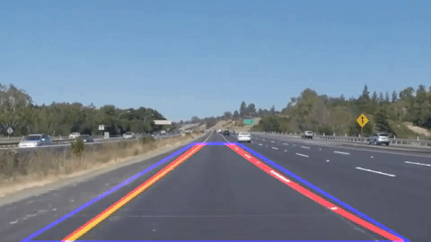
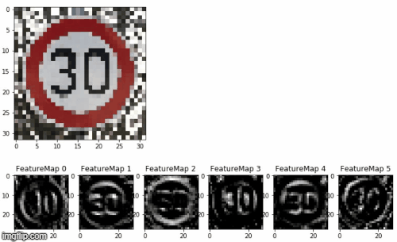
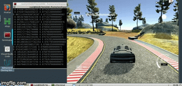
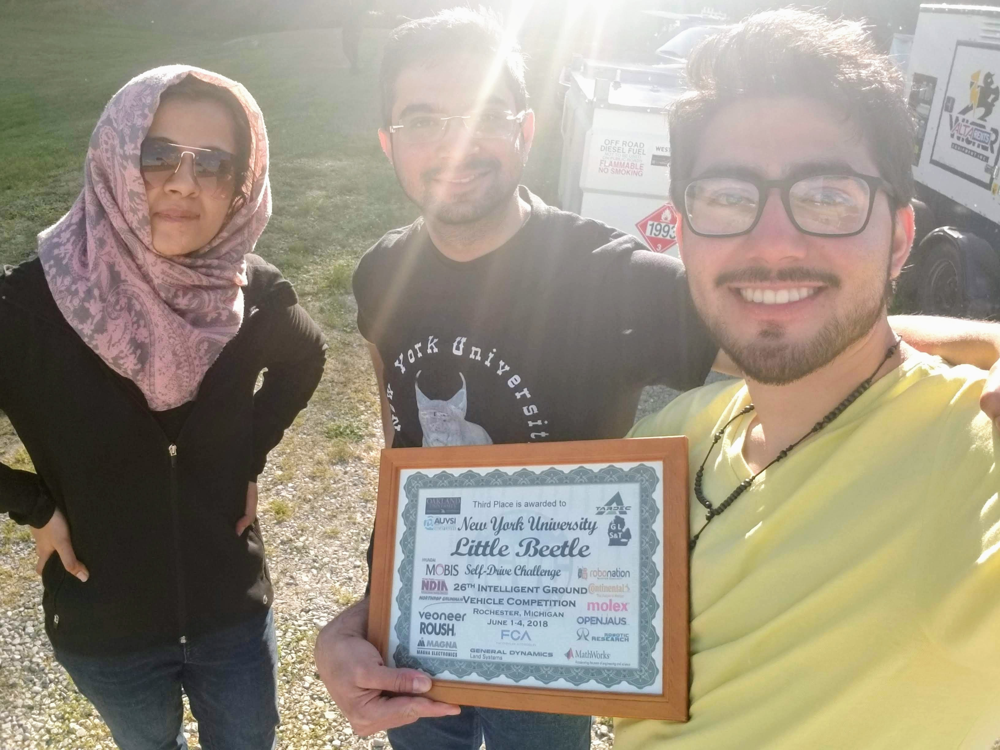

# SelfDrivingCar
Compendium of Self-Driving Car Projects

 
    

[//]: # (-------------------Reference List------------------------------)
[//]: # (Image Directory Paths)
[image1]: ./README_images/simple_lane_detection.gif
[image2]: ./README_images/advanced_lane_detection.gif
[image3]: ./README_images/traffic.gif
[image4]: ./README_images/behavior.gif
[image5]: ./README_images/hardware.gif

[//]: # (Repo URL Links)
[link1]: https://github.com/laygond/Simple-Lane-Detection
[link2]: https://github.com/laygond/Advanced-Lane-Detection
[link3]: https://github.com/laygond/Traffic-Sign-Classifier
[link4]: https://github.com/laygond/Behavioral-Cloning
[link5]: https://github.com/laygond/SelfDrivingCar

# Projects

Simple Lane Detection | Advanced Lane Detection 
:---:|:---:
 |  

Traffic Sign Classifier | Behavioral Clonning
:---:|:---:
 |  

Autonomous Hardware (Soon) | Little Beetle Software (Soon)
:---:|:---:
 |  

# A.I.Madness Team
